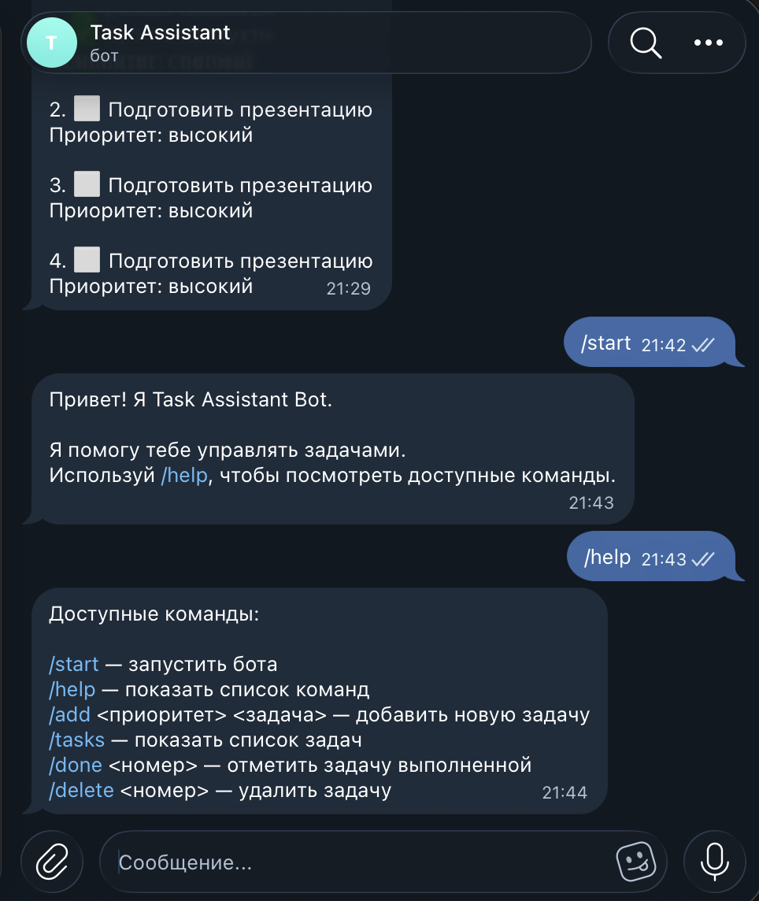
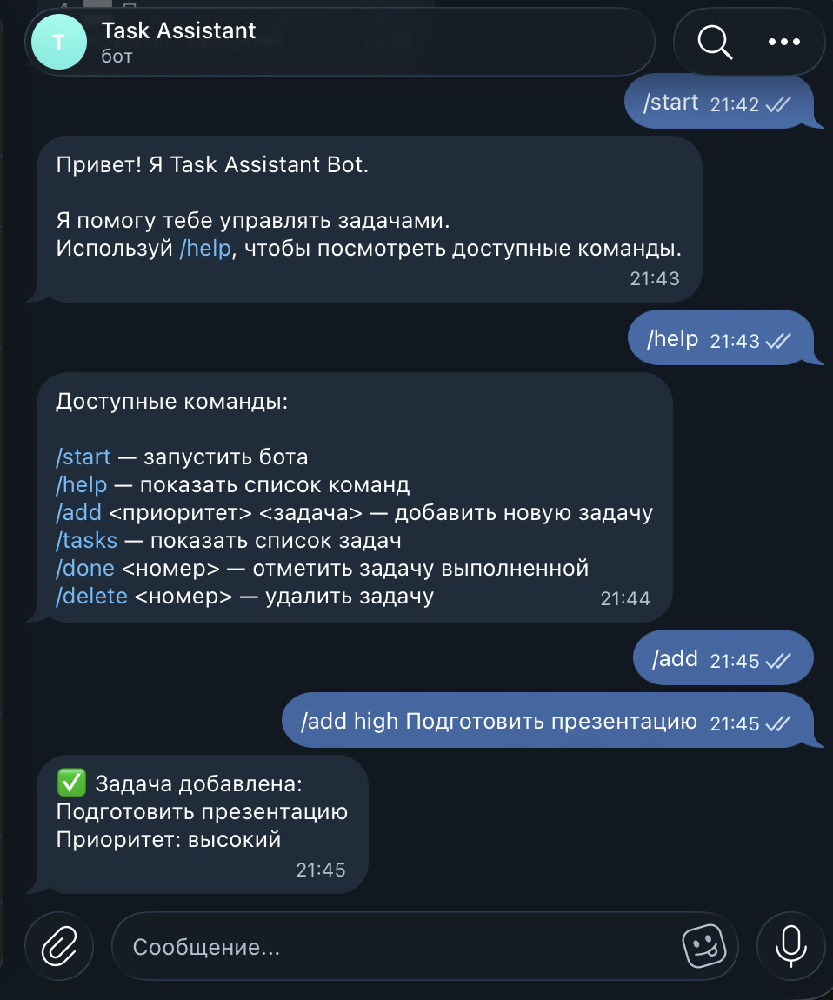
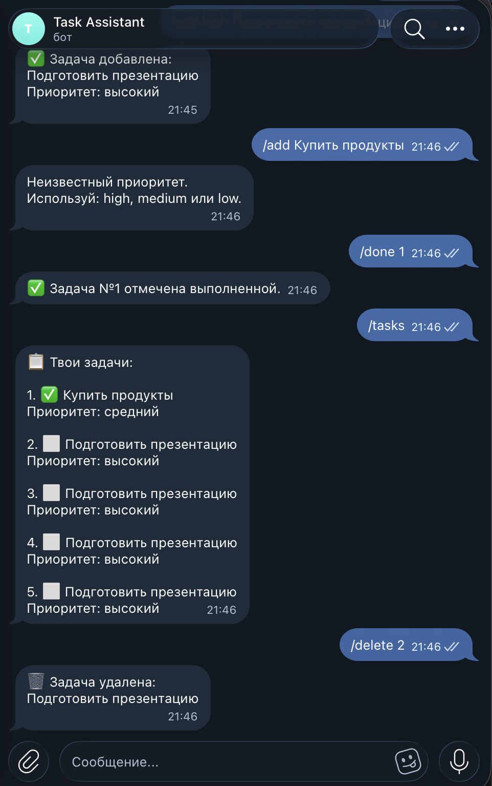

University: [ITMO University](https://itmo.ru/ru/)  
Faculty: [FICT](https://fict.itmo.ru)  
Course: Vibe Coding: AI-боты для бизнеса  
Year: 2026  
Author: Kuhi Arina  
Lab: Lab1  
Date of create: 05.10.2026  
Date of finished:

# Лабораторная работа №1

## 1. Цель работы

Разработать Telegram-бота с использованием Python и Telegram Bot API, применяя инструменты генеративного искусственного интеллекта для создания и последовательного улучшения программного кода.

## 2. Описание задачи

В рамках лабораторной работы был разработан Telegram-бот **Task Assistant Bot**.

Username бота: `@itmoftmi_AK_bot`

Бот предназначен для управления персональными задачами непосредственно в Telegram.

Пользователь может:

- получить справку по доступным командам;
- добавлять новые задачи;
- назначать задачам приоритет;
- просматривать список задач;
- отмечать задачи выполненными;
- удалять задачи.

Данные сохраняются локально в JSON-файле и не теряются после перезапуска программы.

## 3. Решаемая проблема

Для ведения небольшого списка текущих задач пользователю часто приходится использовать отдельные приложения или сервисы.

Разработанный бот позволяет выполнять базовые операции с задачами непосредственно в Telegram без необходимости переходить в другое приложение.

Telegram был выбран как интерфейс, поскольку взаимодействие с ботом осуществляется через простой и привычный формат команд.

## 4. Основной функционал

В боте реализованы следующие команды:

- `/start` — запуск бота и приветственное сообщение;
- `/help` — отображение доступных команд;
- `/add <приоритет> <задача>` — добавление новой задачи;
- `/tasks` — отображение списка задач;
- `/done <номер>` — отметка задачи как выполненной;
- `/delete <номер>` — удаление задачи.

Для команды `/add` используются три уровня приоритета:

- `high` — высокий;
- `medium` — средний;
- `low` — низкий.

Пример:

`/add high Подготовить презентацию`

## 5. Используемые технологии

Для реализации проекта использовались:

- Python 3;
- библиотека `python-telegram-bot`;
- библиотека `python-dotenv`;
- Telegram Bot API;
- JSON для локального хранения данных;
- Git;
- GitHub.

Для защиты Telegram Bot Token используется файл `.env`.

Файл `.env` исключён из Git с помощью `.gitignore`.

В репозитории находится только файл `.env.example`, демонстрирующий формат необходимой переменной окружения.

## 6. Использование генеративного искусственного интеллекта

Код Telegram-бота разрабатывался итерационно с использованием ChatGPT.

### 6.1. Исходный промпт

Первоначальная задача для LLM была сформулирована следующим образом:

Создай Telegram-бота на Python с использованием библиотеки python-telegram-bot.

Бот должен помогать пользователю управлять персональными задачами.

Необходимо реализовать команды /start и /help.

Telegram Bot Token должен загружаться из файла .env, а не храниться непосредственно в исходном коде.

Код должен быть простым, понятным и пригодным для дальнейшего расширения.

### 6.2. Первая итерация

На первом этапе была реализована команда `/start`.

После запуска бот успешно подключился к Telegram Bot API и стал отвечать пользователю приветственным сообщением.

Затем была добавлена команда `/help`.

### 6.3. Вторая итерация

После проверки базовой версии функциональность была расширена.

Был сформулирован дополнительный запрос к LLM:

Добавь возможность создавать задачи и просматривать список задач.

Реализуй команды /add и /tasks.

Задачи каждого Telegram-пользователя должны храниться отдельно.

Для хранения данных используй JSON.

После этого были реализованы:

- добавление задач;
- просмотр задач;
- сохранение информации в `tasks.json`;
- разделение данных по Telegram user ID.

### 6.4. Третья итерация

Следующим этапом была добавлена система приоритетов.

Промпт:

Измени команду /add так, чтобы пользователь мог указывать приоритет задачи.

Поддерживаются три значения:

high — высокий,

medium — средний,

low — низкий.

Бот должен проверять корректность указанного приоритета и выводить понятное сообщение при ошибке.

После изменения команда стала использовать следующий формат:

`/add <приоритет> <задача>`

### 6.5. Четвёртая итерация

После тестирования было принято решение добавить управление уже созданными задачами.

Промпт:

Добавь команды для управления существующими задачами.

/done <номер> должна отмечать выбранную задачу выполненной.

/delete <номер> должна удалять выбранную задачу.

Добавь проверку существования указанного номера задачи и обработку некорректного ввода.

В результате были реализованы команды `/done` и `/delete`.

## 7. Финальный промпт

Финальная формулировка требований к проекту:

Разработай Telegram-бота Task Assistant Bot на Python с использованием python-telegram-bot.

Бот должен поддерживать:

- /start — приветствие;
- /help — справка;
- /add <priority> <task> — добавление задачи;
- /tasks — просмотр задач;
- /done <number> — отметка задачи выполненной;
- /delete <number> — удаление задачи.

Для каждой задачи необходимо хранить текст, приоритет и статус выполнения.

Поддерживаются приоритеты high, medium и low.

Данные разных Telegram-пользователей должны храниться отдельно по user ID.

Для хранения данных необходимо использовать JSON.

Telegram Bot Token должен загружаться из `.env`.

Необходимо обработать ошибки пользователя, включая отсутствие аргументов, неправильный приоритет и неправильный номер задачи.

Код должен быть структурированным и понятным.

## 8. Хранение данных

Данные сохраняются в файле `tasks.json`.

Для каждого пользователя используется его Telegram user ID.

Каждая задача содержит:

- текст задачи;
- приоритет;
- статус выполнения.

Пример структуры данных:

{
    "123456789": [
        {
            "text": "Подготовить презентацию",
            "priority": "высокий",
            "done": false
        }
    ]
}

Файл `tasks.json` добавлен в `.gitignore`, поскольку содержит локальные пользовательские данные.

## 9. Обработка ошибок

В процессе разработки была реализована обработка следующих ситуаций:

- команда `/add` вызвана без задачи;
- не указан приоритет;
- указан неизвестный приоритет;
- для `/done` указан несуществующий номер;
- для `/delete` указан несуществующий номер;
- вместо номера задачи введён текст;
- файл с задачами отсутствует;
- JSON-файл содержит некорректные данные;
- отсутствует переменная `BOT_TOKEN`.

## 10. Запуск проекта

Перейти в папку лабораторной работы:

cd lab1

Создать виртуальное окружение:

python3 -m venv .venv

Активировать его:

source .venv/bin/activate

Установить зависимости:

pip install -r requirements.txt

Создать файл `.env` со следующим содержимым:

BOT_TOKEN=your_telegram_bot_token

Запустить бота:

python bot.py

После запуска бот доступен в Telegram: `@itmoftmi_AK_bot`.

## 11. Полученный результат

В результате лабораторной работы был создан работоспособный Telegram-бот для управления персональными задачами.

Бот позволяет добавлять задачи с различными приоритетами, просматривать их, отмечать выполнение и удалять ненужные задачи.

Также было реализовано постоянное локальное хранение информации в JSON.

## 12. Демонстрация работы бота

### Запуск бота и справка

### Добавление задачи

### Просмотр списка задач

##13. Проблемы в процессе разработки

В ходе работы возникли несколько технических проблем.

### Ошибка с переменной BOT_TOKEN

При первом запуске программа не обнаружила `BOT_TOKEN`.

Причиной было неправильное сохранение значения в `.env`.

После корректного заполнения `.env` бот успешно подключился к Telegram.

### Ошибки отступов Python

При ручном редактировании кода возникала ошибка:

`IndentationError: unexpected indent`

Проблема была устранена после проверки структуры функции `main()` и выравнивания отступов.

### NameError

После одного из этапов ручного изменения файла возникла ошибка:

`NameError: name 'add_task' is not defined`

Причиной стало случайное удаление функции `add_task`.

Для устранения ошибки файл был восстановлен с полной рабочей версией программы.

### Работа с Git

При первоначальной настройке Git возникли проблемы с URL удалённого репозитория и авторизацией GitHub.

После исправления адреса `origin` и авторизации с помощью Personal Access Token изменения были успешно отправлены в GitHub.

## 14. Вывод

В ходе лабораторной работы был разработан Telegram-бот для управления персональными задачами.

Работа позволила изучить базовые принципы Telegram Bot API, работу библиотеки `python-telegram-bot`, использование переменных окружения, хранение данных в JSON, обработку пользовательского ввода и работу с Git/GitHub.

Отдельное внимание было уделено итеративной разработке с использованием LLM: функциональность проекта последовательно расширялась на основе уточняющих промптов и результатов тестирования.

